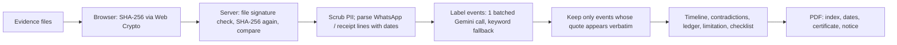

# LeaseGuard: rental agreement risk checker

[](https://github.com/pranavg21/leaseguard/actions/workflows/ci.yml)

**Chosen vertical:** AI for Legal Assistance & Access

**Live app:** [https://leaseguard-897669266422.asia-south1.run.app](https://leaseguard-897669266422.asia-south1.run.app)

LeaseGuard covers a residential tenancy in India from signing to getting the deposit back.

- **Before you sign**, it reviews the rental agreement. It shows **what is unusual, what is missing and what to ask a lawyer**.
- **After you move out**, if the deposit is not returned, it turns raw evidence into a **deposit-recovery dossier**. You add WhatsApp exports, UPI receipts and emails, and it produces:
  - an index of annexures with SHA-256 fingerprints;
  - a dated list of events in which every entry quotes the evidence word for word;
  - a deposit calculation (paid, refunded, deductions);
  - flags where the landlord contradicts himself;
  - the **certificate under Section 63(4)(c) of the Bharatiya Sakshya Adhiniyam, 2023**, using the wording of the Schedule to the Act. Part A is pre-filled with the name, SHA-256 and a hash report; Part B is left blank for an expert;
  - a draft **demand notice**.

Every quote LeaseGuard shows is checked against the source document.

> LeaseGuard provides information and assistance. It does not replace professional legal advice. Every finding ends with a question to take to a lawyer.

---

## How it covers the problem statement

| Use case in the brief | LeaseGuard feature |
|---|---|
| Simplifying complex legal documents | A plain-language explanation of every flagged clause, in English, Hindi or Marathi |
| Comparing contracts, agreements or policies | **Compare two drafts**: an accessible table showing "better / worse / unchanged" for each topic |
| Highlighting clauses, obligations, risks, inconsistencies | Clause-by-clause **Fair / Medium / High** ratings against a documented fair baseline |
| Answering questions based on provided documents | **Ask your agreement**: every answer cites a verified quote, or the app replies "Not stated in your agreement" |
| Helping users understand options and next steps | **Your next steps**: an ordered action plan built from the findings and the user's context. It covers negotiating the flagged clauses, adding missing protections, stamp duty and registration, and lawyer review, and it always ends with **free legal aid** (the NALSA helpline 15100, the District Legal Services Authority, and who is eligible under s.12 of the Legal Services Authorities Act, 1987). The dossier has its own plan: demand notice, s.63 certificate, a free pre-litigation Lok Adalat, the forum and the time limit. |
| Generating summaries, checklists, actionable outputs | **Key terms at a glance**: rent, deposit (also in months of rent), term, lock-in, notice and rent increase, each with the verbatim sentence it came from, or "Not stated". Also risk counts, a missing-protections checklist and downloadable PDFs. |
| Helping users prepare questions for a legal professional | **Lawyer consultation packet** (PDF) with verified quotes and a targeted question for each flagged clause |
| Generating actionable outputs; understanding next steps | **Deposit-recovery dossier** (PDF), made of: an evidence index with SHA-256 fingerprints, a list of dates and events, the deposit calculation, contradiction flags, a limitation reminder, a missing-evidence checklist, the BSA s.63(4)(c) certificate in the Schedule's wording (Part A pre-filled, Part B for an expert) and a draft demand notice |

### Why a dossier as well as a review

Most legal-AI tools stop at explaining a document. Tenants in deposit disputes usually already have the evidence, spread across WhatsApp, UPI apps and email. What stops them is turning it into something a lawyer, a rent authority or a court can use:

- a dated chronology;
- numbered annexures;
- evidence that can be admitted.

For electronic records, admissibility requires a certificate under s.63(4)(c) of the Bharatiya Sakshya Adhiniyam, 2023, which includes the record's hash value.

The dossier does this mechanical work. It does **not** decide the case, choose a forum or file anything. The certificate and notice are drafts for the user to check, complete and sign.

## Approach and logic

Generic "chat with your PDF" tools hallucinate and give different answers from one run to the next. LeaseGuard separates **judgement**, which is deterministic and tested, from **language**, which comes from Gemini:

```mermaid
flowchart LR
  A[Upload or paste] --> B[Validate: file signature, size, pages]
  B --> C[Scrub PII locally]
  C --> D[Segment clauses]
  D --> E[Classify: 1 batched Gemini call]
  E --> F[Rate with baseline rules + user context]
  F --> G[Verify every quote verbatim]
  G --> H[Coverage audit]
  H --> I[Explain in plain language: 1 batched Gemini call]
  I --> J[Report / Q&A / Compare / PDF]
```



The steps in the diagram fall into two groups:

- **Deterministic code** handles ratings, quote verification, PII scrubbing and the coverage audit. The same agreement always gets the same result, and text injected into a document cannot change a rating.
- **Gemini** does three things only: it classifies clauses, rewrites findings in plain language (with translation when asked), and answers questions. Its output must match a JSON schema and is validated with Pydantic. Any failure falls back to the offline engine, so the app never breaks because of the AI.

### How the dossier works



| Step | Who does it | Why |
|---|---|---|
| File fingerprinting (SHA-256) | Deterministic, **twice**: in the browser before upload, then on the server | Any change in transit is flagged. The hash is exact and reproducible. |
| Dates | Deterministic parser (day-first Indian formats; WhatsApp Android and iOS) | The model is never asked for dates, so it cannot invent one. Undated events are marked "DATE NEEDED". |
| Deciding which messages matter (promise, deduction, move-out, payment, refund, demand) | Gemini, with a keyword fallback | Understanding informal chat needs language understanding. |
| Quotes | Copied from the parsed message and checked with `appears_in()` | Every entry in the list of dates is verbatim evidence. |
| Deposit calculation, contradictions, 3-year limitation reminder, checklist | Deterministic | Arithmetic and dates must not be made up. |
| Certificate | Deterministic reproduction of the Schedule to the BSA, 2023, with fixed phrases pinned by tests | Part A pre-fills only what software knows exactly: the name, the SHA-256 box and the hash report. Device details, the declaration and the signature stay blank. Part B is reproduced blank because Section 63(4)(c) requires the person in charge **and an expert** to sign. In *Pune Bar Association v. Union of India* (Supreme Court, 22 May 2026), the Court upheld both requirements and held that the expert may be a Section 79A examiner or another person the Court accepts as skilled in computer science and cyber forensics. |
| Demand notice | Deterministic template filled only with verified facts | Blanks are left for anything unknown. It is marked as a draft for review. |

### Decisions based on user context

| Input | Effect |
|---|---|
| **Role** (tenant or landlord) | Changes the framing. A tenant is told to negotiate before signing. A landlord is told to expect pushback and that the clause may be hard to enforce. |
| **Monthly rent** | Converts a rupee deposit into months of rent. For example, Rs. 1,00,000 is **High** risk at Rs. 10,000 a month and **Fair** at Rs. 50,000 a month. |
| **State** | Maharashtra adds the Maharashtra Rent Control Act, 1999 s.55 note: every leave-and-licence agreement, including 11-month ones, must be registered. The duty to register is on the landlord, and s.55(2) sets a presumption in the licensee's favour if the agreement is not registered. |
| **Agreement term** | A term over 12 months triggers the Registration Act, 1908 s.17(1)(d) reminder. |
| **Language** | Sets the language of the explanations: English, Hindi or Marathi. |

### The fair baseline

The limits live in [`leaseguard/constants.py`](leaseguard/constants.py) and the rules in [`leaseguard/rules/`](leaseguard/rules). Every rating has a stable rule ID, so it can be traced back to the rule that produced it.

| Topic | Baseline | Flagged when |
|---|---|---|
| Security deposit | Up to 2 months' rent (the Model Tenancy Act, 2021 benchmark), refunded on a stated timeline | More than 2 months (Medium); more than 6 months or non-refundable (High); no refund deadline (Medium) |
| Lock-in and notice | Lock-in of 6 months or less; 1–2 months' notice | Lock-in over 6 months (Medium); over 12 months or forfeiture (High); notice over 2 months (Medium) |
| Rent escalation | A fixed 5–10% a year | Over 10% (Medium); over 15% or at the landlord's discretion (High); no stated rate (Medium) |
| Privacy and entry | At least 24 hours' written notice | Entry "at any time" or without notice (High) |
| Maintenance | The tenant does minor repairs; the landlord does structural repairs | Structural repairs on the tenant (High); "all repairs" with no minor/major split (Medium) |
| Disputes | Local courts or a neutral arbitrator | An arbitrator chosen by one party (High) |
| Any clause | No one-sided rights | "Sole discretion", penalty, forfeiture or waiver (Medium) |

## How the solution works

```
leaseguard/
  constants.py      every limit and threshold (no magic numbers)
  models.py         typed dataclasses and StrEnums
  knowledge.py      baseline text, lawyer questions, keywords, states
  ingest.py         upload validation by file signature; size, page and encryption checks
  privacy.py        local scrubbing of Aadhaar, PAN, phone numbers and emails
  segment.py        clause segmentation (numbered, "1)", Roman, "Clause N", "Heading:")
  parsing.py        rupee, month and percentage extraction
  classifier.py     offline keyword classifier
  rules/            table-driven rating rules (bands.py, money.py, terms.py, duties.py)
  context_rules.py  role framing, state and registration notes
  grounding.py      verify_grounding(): a quote must be a normalised substring of the source
  engine.py         the pipeline and a content-hash LRU cache (cache.py)
  compare.py        draft-vs-draft comparison
  qa.py             grounded question answering
  export.py         PDF lawyer consultation packet
  telemetry.py      optional anonymous Firestore metrics
  dossier/          deposit-recovery dossier: evidence.py (signature, SHA-256), messages.py (WhatsApp and
                    receipt parsing), dates.py, events.py, timeline.py, ledger.py, certificate.py, notice.py,
                    pdf.py, service.py
  ai/               Gemini client, offline client, prompts, response schemas
  api/              FastAPI app, request schemas, security middleware, routes, views
  logging_config.py JSON logs in Cloud Logging format
static/             accessible HTML, CSS and ES-module JavaScript; service worker; manifest
tests/              326 pytest tests; tests/js holds 63 Node tests (jsdom)
scripts/audit.py    structural audit, run in CI and by the test suite
```

### API

All `POST` bodies are JSON and are validated with Pydantic, which rejects unknown fields. Errors always come back as `{"error": {"code", "message"}}` and never include a stack trace or the request input.

| Method | Path | Purpose |
|---|---|---|
| GET | `/api/health` | Liveness check |
| GET | `/api/meta` | Roles, states, languages and the current AI mode, so the frontend hard-codes nothing |
| GET | `/api/sample` | Built-in original and revised sample agreements |
| POST | `/api/analyze` | Full review |
| POST | `/api/ask` | Grounded question answering. Send `report_id` and `question`, or the agreement again |
| POST | `/api/compare` | Comparison of two drafts |
| POST | `/api/packet` | PDF consultation packet. Send `report_id`, or the agreement again |
| POST | `/api/dossier` | Deposit-recovery dossier: evidence index, timeline, ledger, contradictions, checklist |
| POST | `/api/dossier/pdf` | Dossier PDF, including the draft s.63 certificate and demand notice. Send `dossier_id`, or the evidence again |

## Google services

| Service | Where it is used |
|---|---|
| **Gemini API** (`gemini-2.5-flash` by default) through the official `google-genai` SDK | Batched clause classification, plain-language and translated explanations, grounded Q&A, and batched labelling of evidence events with neutral summaries. Runs at temperature 0 with `response_json_schema` structured output. |
| **Cloud Run** | Hosts the container ([`Dockerfile`](Dockerfile)), which runs as a non-root user and reads the port from `$PORT`. |
| **Cloud Logging** | All logs are single-line JSON with `severity` and `message` fields, which Cloud Logging parses automatically. Each request logs its method, path, status and latency. |
| **Cloud Firestore** | Optional anonymous usage metrics: risk counts, flagged categories, role and state. Document text, quotes and questions are never stored. It is turned on by setting `FIRESTORE_COLLECTION`. |
| **Secret Manager** | Supplies `GEMINI_API_KEY` to Cloud Run (see Deploy). |

## Security

- **Secrets** come only from the environment or Secret Manager. `.env` is git-ignored, and `.env.example` documents each setting.
- **Privacy:**
  - PII is scrubbed locally before any AI call, and a test checks that it never reaches the model.
  - Documents are processed in memory and are never stored or logged.
  - Firestore records counts only.
- **Input validation:**
  - Every request body is checked against Pydantic schemas with `extra="forbid"` and length limits.
  - Files are identified by their signature (`%PDF-` or UTF-8 text), not by their extension.
  - Limits: 5 MB per file, 5 MB of evidence in total, 40 pages, 8 MB per request body. Encrypted PDFs are rejected.
- **HTTP hardening** runs as middleware on every response:
  - A strict **Content-Security-Policy**: `script-src 'self'`, no inline code, `frame-ancestors 'none'`.
  - HSTS, `X-Content-Type-Options`, `X-Frame-Options`, `Referrer-Policy`, `Permissions-Policy`, COOP and CORP headers.
  - A `Content-Type: application/json` check that returns 415 otherwise.
  - A body-size limit that returns 413.
  - A **rate limit** of 30 requests per minute per client, returning 429.
- **Prompt-injection defence:**
  - Document text is wrapped in delimiters, and any delimiter tags inside it are neutralised.
  - The system instruction tells the model to treat the document as data.
  - Ratings come from rules, not the model, and a test confirms that injected text cannot change them.
- **No XSS surface:**
  - The frontend never uses `innerHTML`. ESLint and the audit script both enforce this.
  - All text is inserted with `textContent`.
  - The API docs UI is disabled, because it would load scripts from a CDN.
- **Hallucination control:** every quote, including those in Q&A answers, must pass `verify_grounding()`. If it fails, the app refuses to answer.

More detail is in [SECURITY.md](SECURITY.md).

## Efficiency

Every row names the test that proves it.

| Technique | Where | Effect | Proved by |
|---|---|---|---|
| Batched AI calls | `ai/gemini.py` | At most **two Gemini calls per review** and **one per dossier**, not one per clause or message | `test_ai_gemini.py` |
| Content-hash caches | `engine.py`, `dossier/service.py` | An unchanged agreement or evidence set is never analysed twice. Failed runs are never cached. | `test_engine.py`, `test_dossier_service.py` |
| **IDs instead of re-uploads** | `/api/ask`, `/api/packet`, `/api/dossier/pdf` | After a review or dossier, follow-ups send a 64-character `report_id` or `dossier_id`, not the document or evidence (up to 8 MB). The server does not decode, parse, hash or call Gemini again. If a server instance no longer holds the result, it answers `404 expired` and the browser sends the full body once. | `test_api_routes.py`, `test_api_dossier.py`, `tests/js/api.test.mjs` |
| Hash each file once | `dossier/service.Upload.sha256` | One SHA-256 per evidence file, shared by the cache key and the evidence index | `test_dossier_service.py` |
| Derived once per report | `engine._build_report` | Key terms and next steps are computed once and reused by the page and the PDF; findings are grouped by category in one pass | `test_engine.py` |
| Normalise once per document | `grounding.NormalisedText` | Checking every quote is linear in document size, not quadratic | `test_grounding.py` |
| Precompiled patterns | module-level `re.compile` | Every regular expression is compiled once at import; anchor phrases use plain `str.find` | `test_parsing.py`, `test_rules.py` |
| O(1) rate limiter | `api/security.RateLimiter` | Clients are kept in least-recently-seen order: idle ones are dropped from the front and memory is capped at 10,000 clients, with no full scans | `test_api_security.py` |
| Size checks before work | `static/js/api.js`, `evidence.js` | Oversized files or bodies are refused in the browser before hashing, encoding or uploading, matching the server limits (5 MB of evidence, 8 MB per request) | `tests/js/api.test.mjs`, `tests/js/evidence.test.mjs` |
| **Real lazy loading** | `static/js/lazy.js`, `static/sw.js` | The three dossier modules (about 9.5 KB) are not in the first-screen download or the service worker's install list. They load with `import()` when that section nears the viewport, gets focus or is clicked. A failed load is reported and retried. | `tests/js/lazy.test.mjs`, `tests/js/sw.test.mjs` |
| Stale-while-revalidate service worker | `static/sw.js` | Repeat visits and offline use are served from cache at once, while the cached copy is refreshed in the background; API calls are never cached | `tests/js/sw.test.mjs` |
| Revalidating HTTP cache | `api/app._revalidate_static` | File names are not versioned, so static files use `no-cache` with ETags: an unchanged file costs a `304` with no body, and a deploy is never masked by a stale cache | `test_api_app.py` |
| gzip where it helps | `api/app.SelectiveGZip` | JSON, HTML, JS and CSS above 1 KB are compressed at level 6. PDFs, which are already compressed, are skipped. | `test_api_app.py` |
| Worker threads | synchronous FastAPI handlers | PDF parsing and AI calls never block the event loop | — |
| No framework, no build step | `static/js/` | About 29 KB of plain ES modules on the first screen (about 9 KB gzipped) | — |
| Slim, non-root container | `Dockerfile` | Installs only pinned runtime dependencies, including `tzdata` | — |

## Accessibility

Accessibility was checked with **axe-core** against WCAG 2.2 AA and best practices on every page state: initial, after results, and offline. **It found 0 violations.**

- A skip link, a single `<h1>` per page, a logical heading order and landmark regions.
- **Risk is never shown by colour alone.** Every rating has an icon and a word ("⛔ High risk"). Colours meet AA contrast, and there is support for `forced-colors`.
- Every input has a visible `<label>`, and help text is linked with `aria-describedby`. Role choices use a `fieldset` and `legend`.
- Results appear in `aria-live` regions, and `aria-busy` is set while work is in progress. Focus moves to the results heading after a review. Errors use `role="alert"`.
- A 3px `:focus-visible` outline and 44px minimum touch targets.
- `prefers-reduced-motion` is respected.
- The comparison table has a `caption` and scoped headers.
- Plain-language explanations are available in **Hindi and Marathi**.

## Quality gates (all run in CI)

| Gate | Result |
|---|---|
| `pytest --cov` | 326 tests, **100% line and branch coverage**, fails below 95% |
| `node --test` (jsdom) | 63 tests covering every JS module and the service worker |
| `ruff check` | Almost every rule set enabled (`select = ["ALL"]`), Google-style docstrings |
| `mypy` | `strict = true`, no `type: ignore` in source |
| `pylint` duplicate-code | 10.00/10 |
| `eslint` | No `console`, no `eval`, no `innerHTML`, no magic numbers, at most 200 lines per file and 30 lines per function |
| `python -m scripts.audit` | Every file has at most 200 lines and every function at most 30; everything public has a docstring; there are no `print` calls, no placeholders and no inline scripts; every module is imported by a test; every page has exactly one `<h1>` and a skip link |

## Run it

```bash
python -m venv .venv && source .venv/bin/activate
pip install -r requirements-dev.txt
export GEMINI_API_KEY=...        # optional; without it the app runs offline
uvicorn leaseguard.api.app:app --reload
# open http://localhost:8000 and click "Load sample agreement"
```

To run the checks:

```bash
pytest --cov && ruff check . && mypy && python -m scripts.audit
npm ci && npm run lint && npm test
```

## Deploy (Google Cloud Run)

```bash
echo -n "$GEMINI_API_KEY" | gcloud secrets create gemini-api-key --data-file=-
gcloud run deploy leaseguard --source . --region asia-south1 --allow-unauthenticated \
  --set-secrets GEMINI_API_KEY=gemini-api-key:latest \
  --set-env-vars FIRESTORE_COLLECTION=leaseguard_metrics
```

## Legal sources

| Claim in the app | Source |
|---|---|
| Certificate wording (Part A and Part B) | The Schedule to the Bharatiya Sakshya Adhiniyam, 2023 ("[See section 63(4)(c)]"). [India Code schedule file](https://upload.indiacode.nic.in/schedulefile?aid=AC_CEN_5_23_00049_2023-47_1719292804654&rid=1163); [transcription on AdvocateKhoj](https://www.advocatekhoj.com/library/bareacts/bharatiyaaakshya2023/b.php) |
| The certificate must be signed by the person in charge **and an expert**, and submitted each time the record is | Section 63(4)(c), BSA 2023 ([Indian Kanoon](https://indiankanoon.org/doc/90089205/)) |
| The hash-value and Part B requirements are valid; the expert may be a s.79A examiner or another person the Court accepts | *Pune Bar Association v. Union of India*, Supreme Court, 22 May 2026, CJI Surya Kant, Bagchi J., Pancholi J. ([Indian Kanoon](https://indiankanoon.org/doc/5836207/)) |
| Deposit benchmark of 2 months' rent | Model Tenancy Act, 2021 (a model law; it applies only where a state has adopted it) |
| Leave-and-licence agreements must be registered | Maharashtra Rent Control Act, 1999, s.55 |
| Leases over one year must be registered | Registration Act, 1908, s.17(1)(d) |

## Assumptions

- Agreements are Indian residential leases or leave-and-licence agreements, written in English and with a text layer. Scanned copies need OCR first, and the app says so.
- The baseline reflects common market norms and the statutes cited above. The Model Tenancy Act, 2021 is a model law that applies only where a state has adopted it, so LeaseGuard uses it as a benchmark, not as binding law.
- When a deposit is stated in rupees, the monthly rent the user enters is used to convert it into months of rent.
- Dossier dates are read day-first (DD/MM/YYYY), as in India. WhatsApp exports must be plain-text `.txt` exports.
- Images are fingerprinted and indexed but not read, so the user describes them.
- The limitation reminder uses the general 3-year period for money claims under the Limitation Act, 1963, counted from move-out. The exact article and start date should be confirmed with a lawyer.
- The dossier does not choose a forum. Deposit disputes with a private landlord usually go through a legal notice and then a civil court or the state rent authority, not the consumer commission. The user should confirm the route with a lawyer.
- The sample evidence is synthetic: every name, amount and message is invented.
- LeaseGuard gives information, not legal advice.

## License

MIT
